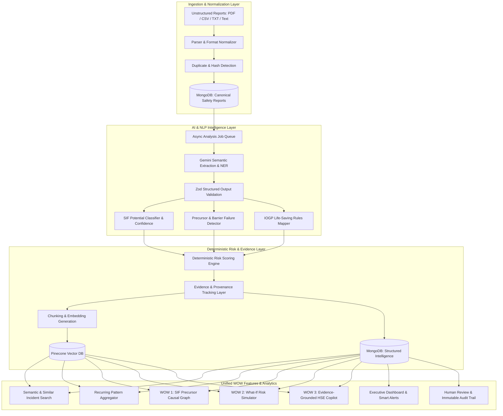
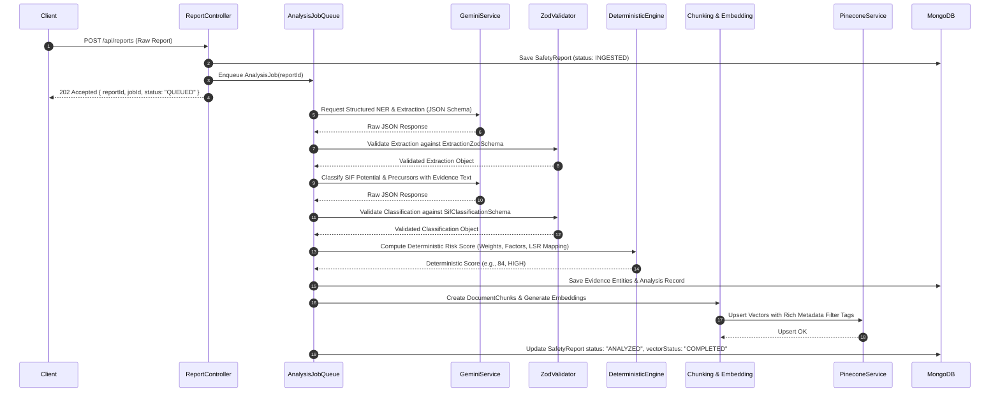
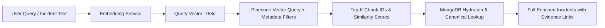
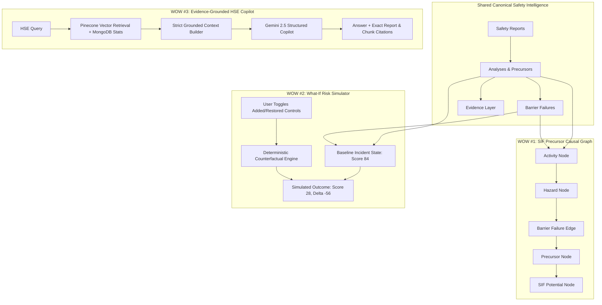

# PHASE 0 — Architecture Specification & Implementation Plan
## SIH 2026 — PS 26165: AI/NLP Engine to Detect Serious Injury & Fatality (SIF) Precursors

---

## 1. Executive Summary & Problem Overview

In high-hazard industries (oil & gas, construction, manufacturing, chemical processing, mining), thousands of low-consequence or near-miss safety observations are reported annually. Traditional HSE systems treat these reports uniformly or rely on manual review, often missing **Serious Injury and Fatality (SIF) Precursors**—the specific high-energy hazards and failed/missing critical controls that, under slightly altered circumstances, would have resulted in a life-altering injury or fatality.

**PS 26165 Goal**: Build a complete, enterprise-grade, explainable AI/NLP Backend MVP that ingests unstructured multi-format reports (PDF, CSV, TXT, text), normalizes them, extracts safety entities, classifies SIF potential, detects precursors, maps to official IOGP Life-Saving Rules, calculates deterministic explainable risk scores, indexes vector embeddings in Pinecone, and powers three unified "WOW" capabilities:
1. **SIF Precursor Causal Graph** (Interactive evidence-backed causal relationship network)
2. **What-If Risk Simulator** (Deterministic barrier & control mitigation counterfactual engine)
3. **Evidence-Grounded HSE Copilot** (Strictly grounded RAG assistant with anti-hallucination citations)



---

## 2. Clean Layered Architecture & Module Boundaries

The backend will reside in `Backend/` (or `server/`) using **100% ES Modules (`"type": "module"`)** and a strict layered architecture:

```
Backend/
├── package.json
├── README.md
├── .env.example
├── .gitignore
├── Dockerfile
├── docker-compose.yml
├── vitest.config.js
│
├── src/
│   ├── server.js                        # HTTP Server bootstrap & graceful shutdown
│   ├── app.js                           # Express application & middleware assembly
│   │
│   ├── config/
│   │   ├── env.js                       # Zod-validated environment config
│   │   ├── db.js                        # Mongoose connection & connection pool tuning
│   │   ├── ai.js                        # Google Gemini Client configuration
│   │   └── pinecone.js                  # Pinecone Index client & namespace config
│   │
│   ├── constants/
│   │   ├── report.constants.js          # Report types (UA, UC, NEAR_MISS, INCIDENT, etc.)
│   │   ├── sif.constants.js             # SIF_POTENTIAL, NON_SIF, NEEDS_REVIEW
│   │   ├── precursor.constants.js       # Precursor Taxonomy (14 standard categories)
│   │   ├── severity.constants.js        # Severity scales & actual vs potential outcomes
│   │   ├── priority.constants.js        # CRITICAL, HIGH, MEDIUM, LOW priority definitions
│   │   ├── review.constants.js          # Human review action enums & status
│   │   └── lifeSavingRules.constants.js # IOGP Official Life-Saving Rules reference
│   │
│   ├── models/
│   │   ├── User.js                      # Authentication & RBAC (Admin, HSE Officer, Reviewer)
│   │   ├── SafetyReport.js              # Canonical raw & normalized report record
│   │   ├── Analysis.js                  # Versioned AI NLP extraction & intelligence output
│   │   ├── AnalysisJob.js               # Asynchronous analysis job tracking & step states
│   │   ├── Evidence.js                  # Granular text snippets & provenance pointers
│   │   ├── DocumentChunk.js             # Semantic text chunks for embeddings & Pinecone
│   │   ├── LifeSavingRule.js            # Official IOGP rule knowledge base
│   │   ├── Pattern.js                   # Recurring multidimensional pattern clusters
│   │   ├── Alert.js                     # Smart prioritised safety alerts
│   │   ├── Review.js                    # Human review overrides & justifications
│   │   └── AuditLog.js                  # Immutable audit trail of all actions
│   │
│   ├── controllers/
│   │   ├── auth.controller.js
│   │   ├── report.controller.js
│   │   ├── analysis.controller.js
│   │   ├── precursor.controller.js
│   │   ├── similarity.controller.js
│   │   ├── pattern.controller.js
│   │   ├── graph.controller.js
│   │   ├── simulator.controller.js
│   │   ├── copilot.controller.js
│   │   ├── dashboard.controller.js
│   │   ├── alert.controller.js
│   │   ├── review.controller.js
│   │   ├── audit.controller.js
│   │   └── health.controller.js
│   │
│   ├── routes/
│   │   ├── auth.routes.js
│   │   ├── report.routes.js
│   │   ├── analysis.routes.js
│   │   ├── precursor.routes.js
│   │   ├── similarity.routes.js
│   │   ├── pattern.routes.js
│   │   ├── graph.routes.js
│   │   ├── simulator.routes.js
│   │   ├── copilot.routes.js
│   │   ├── dashboard.routes.js
│   │   ├── alert.routes.js
│   │   ├── review.routes.js
│   │   ├── audit.routes.js
│   │   └── health.routes.js
│   │
│   ├── middleware/
│   │   ├── auth.middleware.js           # JWT authentication & extraction
│   │   ├── role.middleware.js           # Role-based authorization
│   │   ├── validation.middleware.js     # Generic Zod request schema validator
│   │   ├── upload.middleware.js         # Multer configuration with magic number / MIME verification
│   │   ├── rateLimiter.middleware.js    # Express rate limiting
│   │   ├── errorHandler.middleware.js   # Centralized error handler & status mapping
│   │   └── requestLogger.middleware.js  # Structured request/response logging
│   │
│   ├── validators/
│   │   ├── auth.validator.js
│   │   ├── report.validator.js
│   │   ├── aiOutput.validator.js        # Zod schemas for validating all Gemini outputs
│   │   ├── simulator.validator.js
│   │   ├── copilot.validator.js
│   │   └── review.validator.js
│   │
│   ├── services/
│   │   ├── ingestion/
│   │   │   ├── TextParser.js
│   │   │   ├── PdfParser.js
│   │   │   ├── CsvParser.js
│   │   │   ├── NormalizationService.js
│   │   │   └── DuplicateDetectionService.js
│   │   ├── ai/
│   │   │   ├── GeminiService.js         # Core Gemini invocation with retry & schema enforcement
│   │   │   └── PromptService.js
│   │   ├── nlp/
│   │   │   ├── ExtractionService.js     # Entity & barrier extraction
│   │   │   └── ChunkingService.js       # Sliding-window & semantic chunking
│   │   ├── sif/
│   │   │   └── SifClassifierService.js  # SIF potential & confidence assessment
│   │   ├── precursor/
│   │   │   └── PrecursorService.js      # Precursor detection & barrier mapping
│   │   ├── barrier/
│   │   │   └── BarrierService.js        # Hierarchy of controls & barrier status
│   │   ├── lifeSavingRules/
│   │   │   └── LifeSavingRulesService.js# Deterministic IOGP mapping
│   │   ├── risk/
│   │   │   └── RiskScoringEngine.js     # Deterministic reproducible risk scoring
│   │   ├── embeddings/
│   │   │   └── EmbeddingService.js      # Gemini text-embedding-004 / modern embeddings
│   │   ├── vector/
│   │   │   ├── PineconeService.js       # Pinecone CRUD & vector queries
│   │   │   └── VectorSearchService.js   # Similarity & metadata-filtered search
│   │   ├── rag/
│   │   │   ├── RetrievalService.js      # Hybrid vector + metadata retrieval
│   │   │   ├── ContextBuilder.js        # Grounded context compiler with token budgeting
│   │   │   └── RAGService.js            # End-to-end RAG workflow
│   │   ├── patterns/
│   │   │   └── PatternDetectionService.js# Multi-factor MongoDB aggregation & trends
│   │   ├── graph/
│   │   │   └── PrecursorGraphService.js # Causal graph node & edge generator (WOW #1)
│   │   ├── simulator/
│   │   │   └── RiskSimulatorService.js  # What-If counterfactual scenario engine (WOW #2)
│   │   ├── copilot/
│   │   │   └── HSECopilotService.js     # Evidence-grounded conversational agent (WOW #3)
│   │   ├── alerts/
│   │   │   └── AlertService.js          # Deterministic priority engine & alert generator
│   │   ├── review/
│   │   │   └── ReviewService.js         # Human-in-the-loop workflow
│   │   └── audit/
│   │       └── AuditService.js          # Immutable audit event logger
│   │
│   ├── prompts/
│   │   ├── reportExtraction.prompt.js
│   │   ├── sifClassification.prompt.js
│   │   ├── precursorDetection.prompt.js
│   │   ├── explanation.prompt.js
│   │   └── copilot.prompt.js
│   │
│   ├── utils/
│   │   ├── logger.js
│   │   ├── hash.js                      # SHA-256 content hashing
│   │   ├── apiResponse.js               # Standard { success, data, error } envelopes
│   │   └── appError.js                  # Custom domain error class
│   │
│   └── jobs/
│       └── AnalysisQueue.js             # In-memory / background async job runner
│
├── scripts/
│   ├── seed/
│   │   ├── seedIOGPRules.js             # Official IOGP Life-Saving Rules dataset
│   │   ├── seedSyntheticReports.js      # 35+ realistic high-fidelity safety reports
│   │   └── seedUsers.js                 # Admin, HSE Officer, Reviewer seed users
│   └── evaluation/
│       └── runEvaluation.js             # Model evaluation runner against gold standard
│
├── tests/
│   ├── fixtures/
│   │   ├── sample_reports.json
│   │   ├── sif_cases.json
│   │   ├── precursor_cases.json
│   │   └── evaluation_gold_standard.json
│   ├── unit/
│   │   ├── riskEngine.test.js
│   │   ├── duplicateDetection.test.js
│   │   ├── chunking.test.js
│   │   ├── simulator.test.js
│   │   └── validation.test.js
│   └── integration/
│       ├── auth.api.test.js
│       ├── reportIngestion.api.test.js
│       ├── analysis.api.test.js
│       ├── graph.api.test.js
│       └── copilot.api.test.js
│
└── docs/
    ├── architecture.md
    ├── api.md
    ├── ai-pipeline.md
    ├── rag.md
    └── safety-model.md
```

---

## 3. MongoDB vs Pinecone Responsibility & Database Schemas

### 3.1 Division of Responsibility
- **MongoDB (Canonical Source of Truth)**: Holds all business entities, user accounts, raw files, normalized reports, full AI extractions, deterministic risk calculations, versioned analyses, human review overrides, and immutable audit trails. The system is 100% functional for core reporting even if Pinecone is offline.
- **Pinecone (Vector Retrieval & Similarity Engine)**: Indexes document chunk embeddings along with rich structured metadata for semantic search, similar incident clustering, and grounded RAG context retrieval.

### 3.2 Canonical Data Schemas (Mongoose)

#### `SafetyReport` Schema
```javascript
{
  reportId: { type: String, unique: true, index: true }, // e.g. "INC-2026-001"
  sourceType: { type: String, enum: ["PDF", "CSV", "TXT", "TEXT", "API"], required: true },
  originalFileName: String,
  originalContent: { type: String, required: true },
  contentHash: { type: String, index: true, required: true }, // SHA-256 for duplicate check
  normalizedReport: {
    reportType: { type: String, enum: ["UNSAFE_ACT", "UNSAFE_CONDITION", "NEAR_MISS", "INCIDENT", "OBSERVATION"], required: true, index: true },
    title: String,
    description: { type: String, required: true },
    eventDate: { type: Date, required: true, index: true },
    site: { type: String, required: true, index: true },
    facility: String,
    location: { type: String, required: true, index: true },
    department: String,
    activity: { type: String, required: true, index: true },
    equipment: [String],
    reporterRole: String,
    actualOutcome: {
      injurySeverity: { type: String, enum: ["NONE", "FIRST_AID", "MEDICAL_TREATMENT", "LOST_TIME", "FATALITY"], default: "NONE" },
      damageSeverity: { type: String, enum: ["NONE", "MINOR", "MODERATE", "MAJOR", "CATASTROPHIC"], default: "NONE" },
      description: String
    }
  },
  status: { type: String, enum: ["INGESTED", "QUEUED", "ANALYZING", "ANALYZED", "REVIEWED", "FAILED"], default: "INGESTED", index: true },
  isDuplicate: { type: Boolean, default: false, index: true },
  duplicateOf: { type: String, default: null },
  duplicateType: { type: String, enum: ["EXACT_ID", "CONTENT_HASH", "SEMANTIC_SIMILAR"], default: null },
  vectorStatus: { type: String, enum: ["PENDING", "PROCESSING", "COMPLETED", "FAILED", "OUTDATED"], default: "PENDING", index: true },
  createdBy: { type: mongoose.Schema.Types.ObjectId, ref: "User" },
  timestamps: true
}
```

#### `Analysis` Schema (Versioned Safety Intelligence)
```javascript
{
  analysisId: { type: String, unique: true, index: true },
  reportId: { type: String, ref: "SafetyReport", required: true, index: true },
  version: { type: Number, default: 1 },
  isLatest: { type: Boolean, default: true, index: true },
  aiMetadata: {
    model: { type: String, default: "gemini-2.5-flash" },
    promptVersion: { type: String, default: "sif-v1.0" },
    taxonomyVersion: { type: String, default: "precursor-v1.0" },
    riskEngineVersion: { type: String, default: "risk-calc-v1.0" },
    executionTimeMs: Number
  },
  nlpExtraction: {
    hazards: [{ name: String, category: String, description: String }],
    energySources: [{ type: String, magnitude: String, controlled: Boolean }],
    barriers: [{
      name: String,
      category: { type: String, enum: ["ENGINEERING", "ADMINISTRATIVE", "PPE", "PROCEDURAL", "HUMAN"] },
      status: { type: String, enum: ["PRESENT_EFFECTIVE", "DEGRADED", "FAILED", "MISSING"] },
      evidenceText: String
    }],
    unsafeActs: [String],
    unsafeConditions: [String],
    consequences: {
      potentialInjuries: [String],
      potentialFatalities: Boolean,
      worstCaseConsequence: String
    }
  },
  sifClassification: {
    classification: { type: String, enum: ["SIF_POTENTIAL", "NON_SIF", "NEEDS_REVIEW"], required: true, index: true },
    modelConfidence: { type: Number, min: 0, max: 1, required: true }, // e.g. 0.92
    classificationReason: { type: String, required: true },
    isHighPotentialEvent: { type: Boolean, default: false },
    actualVsPotentialDistinction: {
      actualOutcome: String,
      potentialOutcome: String,
      divergenceReason: String
    }
  },
  precursors: [{
    type: { type: String, index: true }, // e.g. "ENERGY_EXPOSURE", "WORKING_AT_HEIGHT"
    confidence: Number,
    severity: { type: String, enum: ["CRITICAL", "HIGH", "MEDIUM", "LOW"] },
    evidenceText: String,
    failedBarriers: [String]
  }],
  lifeSavingRuleMappings: [{
    ruleId: { type: String, ref: "LifeSavingRule" },
    ruleName: String,
    mappingReason: String,
    confidence: Number,
    evidenceText: String
  }],
  riskScore: {
    score: { type: Number, min: 0, max: 100, required: true, index: true }, // Deterministic
    level: { type: String, enum: ["LOW", "MEDIUM", "HIGH", "CRITICAL"], index: true },
    dominantFactor: String,
    factors: [{ factor: String, weight: Number, impact: Number, reason: String }]
  },
  priority: {
    level: { type: String, enum: ["LOW", "MEDIUM", "HIGH", "CRITICAL"], required: true, index: true },
    reasons: [String]
  },
  recommendations: [{
    action: String,
    hierarchyLevel: String,
    targetBarrier: String
  }],
  evidenceIds: [{ type: mongoose.Schema.Types.ObjectId, ref: "Evidence" }],
  timestamps: true
}
```

#### `DocumentChunk` Schema (Vector Chunking)
```javascript
{
  chunkId: { type: String, unique: true, index: true }, // e.g. "chunk_INC-2026-001_01"
  reportId: { type: String, ref: "SafetyReport", index: true, required: true },
  chunkIndex: { type: Number, required: true },
  content: { type: String, required: true },
  tokenCount: Number,
  metadata: {
    site: String,
    activity: String,
    location: String,
    reportType: String,
    sifStatus: String,
    precursors: [String],
    hazards: [String],
    eventDate: Date
  },
  embeddingModel: String,
  embeddingDimension: Number,
  isIndexedInPinecone: { type: Boolean, default: false },
  indexedAt: Date,
  timestamps: true
}
```

#### `LifeSavingRule` Schema (Official IOGP Baseline)
```javascript
{
  ruleId: { type: String, unique: true, index: true }, // e.g. "IOGP-LSR-01"
  officialName: { type: String, required: true },       // e.g. "Energy Isolation"
  icon: String,
  version: { type: String, default: "IOGP-2020-v1" },
  description: { type: String, required: true },
  source: { type: String, default: "IOGP Report 459 - Life-Saving Rules" },
  sourceUrl: { type: String, default: "https://www.iogp.org/life-savingrules/" },
  applicablePrecursors: [String],                       // ["ENERGY_EXPOSURE", "ISOLATION_FAILURE", "PRESSURE_RELEASE"]
  applicableHazards: [String],
  mandatoryActions: [String]
}
```

#### `Pattern` Schema (Recurring Clusters)
```javascript
{
  patternId: { type: String, unique: true, index: true },
  signature: { type: String, unique: true, index: true }, // e.g. "SiteA|Maintenance|ISOLATION_FAILURE|ENERGY_EXPOSURE"
  dimensions: {
    site: String,
    activity: String,
    location: String,
    hazard: String,
    precursor: String,
    barrierFailure: String
  },
  reportCount: { type: Number, default: 0, index: true },
  supportingReportIds: [String],
  firstSeen: Date,
  lastSeen: Date,
  trend: { type: String, enum: ["INCREASING", "STABLE", "DECREASING"], default: "STABLE" },
  trendPercentage: Number,
  riskLevel: { type: String, enum: ["LOW", "MEDIUM", "HIGH", "CRITICAL"] },
  lastCalculatedAt: Date
}
```

#### `Review` Schema & `AuditLog` Schema
```javascript
// Review Schema
{
  reviewId: { type: String, unique: true, index: true },
  reportId: { type: String, ref: "SafetyReport", required: true, index: true },
  analysisId: { type: String, ref: "Analysis", required: true },
  aiClassification: String,
  humanClassification: { type: String, enum: ["SIF_POTENTIAL", "NON_SIF", "NEEDS_REVIEW"], required: true },
  action: { type: String, enum: ["CONFIRMED", "MODIFIED", "REJECTED"], required: true },
  reviewReason: { type: String, required: true },
  reviewerId: { type: mongoose.Schema.Types.ObjectId, ref: "User", required: true },
  reviewerName: String,
  previousState: mongoose.Schema.Types.Mixed,
  finalRiskScore: Number,
  timestamps: true
}

// AuditLog Schema
{
  auditId: { type: String, unique: true, index: true },
  entityType: { type: String, enum: ["REPORT", "ANALYSIS", "REVIEW", "SIMULATOR", "COPILOT", "SYSTEM"], index: true },
  entityId: { type: String, index: true },
  action: { type: String, required: true },
  performedBy: { type: String, required: true },
  userRole: String,
  details: mongoose.Schema.Types.Mixed,
  ipAddress: String,
  createdAt: { type: Date, default: Date.now, index: true }
}
```

---

## 4. AI / NLP Pipeline & Evidence Provenance Architecture



### 4.1 Strict Distinction: Model Confidence vs Scenario Risk Score
- **Model Confidence (0.0 to 1.0 / 0% to 100%)**: Indicates the LLM's certainty that a report matches the definition of a SIF Precursor or SIF Potential event based on textual evidence.
- **Scenario Risk Score (0 to 100)**: Calculated by our deterministic algorithmic scoring engine based on:
  1. Base Hazard Weight (e.g., High Voltage: +30, Fall > 2m: +30)
  2. Failed/Missing Critical Barriers (+15 to +25 each)
  3. Precursor Multiplier (1.2x for active Line-of-Fire / Energy exposure)
  4. Mitigating Controls Present (-10 to -20)
  *Gemini NEVER fabricates or computes this final risk score.*

---

## 5. Pinecone Vector DB & RAG Architecture

### 5.1 Pinecone Index Specification
- **Index Name**: `sih-sif-precursors`
- **Dimension**: `768` (or `1536` depending on embedding model, e.g. `text-embedding-004` uses 768)
- **Metric**: `cosine`
- **Namespace**: `safety-reports-v1`

### 5.2 Metadata Payload on Vectors
```json
{
  "reportId": "INC-2026-001",
  "chunkId": "chunk_INC-2026-001_01",
  "reportType": "NEAR_MISS",
  "site": "Offshore Platform Alpha",
  "facility": "Gas Compression Module",
  "location": "Deck Level 3",
  "activity": "Preventative Maintenance",
  "precursors": ["ENERGY_EXPOSURE", "ISOLATION_FAILURE"],
  "hazards": ["Pressurized Hydrocarbons", "Electrical 440V"],
  "sifStatus": "SIF_POTENTIAL",
  "severity": "HIGH",
  "riskScore": 84,
  "date": 1785542400000,
  "sourceType": "PDF",
  "textSnippet": "Technician unbolted flange without verifying zero energy state on valve V-102..."
}
```

### 5.3 Semantic Search & Hybrid Retrieval Pipeline


---

## 6. Three "WOW" Architectural Features (Unified Intelligence)



### 6.1 WOW #1: SIF Precursor Causal Graph Engine
- **Endpoint**: `GET /api/graph` (Supports filters: `site`, `activity`, `precursor`, `dateRange`, `minWeight`)
- **Node Types**: `ACTIVITY`, `HAZARD`, `EXPOSURE`, `BARRIER_FAILURE`, `PRECURSOR`, `SIF_POTENTIAL`
- **Edge Types**: `LEADS_TO`, `FAILS_BARRIER`, `EXPOSES_TO`, `PRECURSOR_OF`
- **Data Integrity**: Every edge contains `weight` (co-occurrence count), `evidenceReportCount`, and array of `evidenceReportIds`. Clicking any node or edge fetches the exact supporting incident records.

### 6.2 WOW #2: What-If Risk Simulator (Scenario Counterfactual Engine)
- **Endpoint**: `POST /api/simulator/evaluate`
- **Mechanism**:
  1. Ingests a baseline `reportId` (e.g. Risk Score: 82, Dominant Factor: "Isolation Failure")
  2. Accepts an array of proposed or simulated controls (e.g., `["PHYSICAL_LOTO_DEVICE", "DIGITAL_PERMIT_VERIFICATION", "STANDBY_SAFETY_OBSERVER"]`)
  3. Re-evaluates barrier effectiveness through deterministic mitigation matrices:
     $$\text{Score}_{\text{new}} = \max\left(5, \text{Score}_{\text{base}} - \sum \text{ControlMitigationImpact} \times \text{HierarchyWeight}\right)$$
  4. Returns `before`, `after`, `delta`, `changedFactors`, and an explainable technical justification.

### 6.3 WOW #3: Evidence-Grounded HSE Copilot
- **Endpoint**: `POST /api/copilot/query`
- **Anti-Hallucination Protocol**:
  1. Classifies query intent (Incident Search, Statistical Trend, Precursor Investigation, Rule Inquiry).
  2. Queries MongoDB aggregation pipeline for exact statistics (counts, trend %, sites).
  3. Queries Pinecone vector search for top-5 most relevant incident chunks.
  4. Injects verified facts + retrieved chunks into a strict system prompt instructing Gemini to cite specific `reportId` and `chunkId` for every claim.
  5. If no relevant chunks or statistics exist, returns: *"Insufficient evidence is available in the current safety dataset to answer this query."*

---

## 7. Complete API Specification

| HTTP Method | Route | Description | Auth Required |
|:---|:---|:---|:---:|
| **Auth** | | | |
| `POST` | `/api/auth/register` | Register new HSE user | Public |
| `POST` | `/api/auth/login` | Login and retrieve JWT token | Public |
| `GET` | `/api/auth/me` | Get current user profile | Bearer Token |
| **Reports** | | | |
| `POST` | `/api/reports` | Create manual structured/text report | Bearer Token |
| `POST` | `/api/reports/upload` | Upload PDF / CSV / TXT report | Bearer Token |
| `GET` | `/api/reports` | List reports with search & multi-filter | Bearer Token |
| `GET` | `/api/reports/:id` | Get full canonical report details | Bearer Token |
| `PATCH` | `/api/reports/:id` | Update report metadata | Bearer Token |
| `DELETE` | `/api/reports/:id` | Delete report (Admin only) | Admin |
| **Analysis** | | | |
| `POST` | `/api/reports/:id/analyze` | Trigger async AI analysis job | Bearer Token |
| `POST` | `/api/reports/:id/reanalyze` | Force re-analysis with latest models | Bearer Token |
| `GET` | `/api/analysis/jobs/:jobId` | Poll analysis job status and steps | Bearer Token |
| `GET` | `/api/analysis/:reportId` | Get versioned analysis intelligence | Bearer Token |
| **Precursors & LSR** | | | |
| `GET` | `/api/precursors` | List all 14 precursor taxonomy definitions | Bearer Token |
| `GET` | `/api/precursors/:type` | Get precursor analytics and report lists | Bearer Token |
| `GET` | `/api/life-saving-rules` | Get official IOGP Life-Saving Rules KB | Bearer Token |
| **Vector & Similarity**| | | |
| `GET` | `/api/similar/:reportId` | Find semantically similar incidents via Pinecone | Bearer Token |
| `POST` | `/api/search/semantic` | Free-text semantic incident search | Bearer Token |
| **Patterns & Graph** | | | |
| `GET` | `/api/patterns` | List recurring multi-factor incident clusters | Bearer Token |
| `GET` | `/api/patterns/:id` | Get pattern details and timeline | Bearer Token |
| `GET` | `/api/graph` | WOW #1: Get SIF Precursor Causal Graph | Bearer Token |
| **Simulator & Copilot**| | | |
| `POST` | `/api/simulator/evaluate` | WOW #2: What-If Risk Simulation Engine | Bearer Token |
| `POST` | `/api/copilot/query` | WOW #3: Evidence-Grounded HSE Copilot | Bearer Token |
| **Dashboard & Alerts** | | | |
| `GET` | `/api/dashboard/overview` | KPI summaries, trends, SIF distribution | Bearer Token |
| `GET` | `/api/dashboard/trends` | Time-series trend analysis | Bearer Token |
| `GET` | `/api/alerts` | List prioritised safety alerts | Bearer Token |
| `PATCH` | `/api/alerts/:id/status`| Acknowledge or resolve an alert | Bearer Token |
| **Review & Audit** | | | |
| `POST` | `/api/reviews` | Submit human HSE review / override | HSE Reviewer |
| `GET` | `/api/audit/:reportId` | Get immutable provenance audit trail | Bearer Token |
| `GET` | `/api/health` | Service health, DB & Pinecone status | Public |

---

## 8. Security Architecture & Safeguards

1. **Authentication & Authorization**:
   - Industry-standard JWT with expiration (e.g., 24h).
   - Passwords hashed with `bcryptjs` (salt rounds: 12).
   - Role-Based Access Control (RBAC): `ADMIN`, `HSE_OFFICER`, `REVIEWER`, `VIEWER`.
2. **File Upload Security**:
   - Multi-stage validation: File extension whitelist (`.pdf`, `.csv`, `.txt`), MIME type verification, and file size limits (e.g., max 10MB).
   - Sanitized filenames to prevent path traversal attacks (`../`).
   - In-memory/temp buffer processing with automatic cleanup.
3. **Input Sanitization & Injection Prevention**:
   - Strict Zod validation on every request body, query parameter, and route parameter.
   - Mongoose parameterized queries prevent NoSQL injection.
4. **Environment & Secrets**:
   - Secrets managed via `.env` and validated at startup using Zod in `src/config/env.js`.
   - Never committed to git; `.gitignore` strictly protects `.env`.
5. **Centralized Error Handling**:
   - No stack traces or internal implementation details leaked in production responses.
   - Consistent error envelope format: `{ "success": false, "error": { "code": "ERROR_CODE", "message": "User-friendly message" } }`.

---

## 9. Dependencies & ES Modules Configuration

### `package.json` Specification
```json
{
  "name": "sih-sif-precursor-engine-backend",
  "version": "1.0.0",
  "type": "module",
  "scripts": {
    "dev": "nodemon src/server.js",
    "start": "node src/server.js",
    "test": "vitest run",
    "test:watch": "vitest",
    "seed": "node scripts/seed/seedAll.js",
    "eval": "node scripts/evaluation/runEvaluation.js"
  },
  "dependencies": {
    "@google/genai": "^0.1.1",
    "@pinecone-database/pinecone": "^5.0.2",
    "bcryptjs": "^3.0.2",
    "cors": "^2.8.5",
    "csv-parse": "^5.6.0",
    "dotenv": "^16.4.7",
    "express": "^4.21.2",
    "express-rate-limit": "^7.5.0",
    "jsonwebtoken": "^9.0.2",
    "mongoose": "^8.10.1",
    "multer": "^1.4.5-lts.1",
    "pdf-parse": "^1.1.1",
    "zod": "^3.24.2"
  },
  "devDependencies": {
    "nodemon": "^3.1.9",
    "supertest": "^7.0.0",
    "vitest": "^3.0.6"
  }
}
```

---

## 10. Environment Variables Specification (`.env.example`)

```bash
# Server Configuration
PORT=5000
NODE_ENV=development
CORS_ORIGIN=http://localhost:5173

# MongoDB Configuration
MONGODB_URI=mongodb://localhost:27017/sih_sif_intelligence

# JWT Authentication
JWT_SECRET=super_secret_jwt_key_sih_2026_change_in_production
JWT_EXPIRES_IN=24h

# Google Gemini API
GOOGLE_API_KEY=your_gemini_api_key_here
GEMINI_MODEL=gemini-2.5-flash
EMBEDDING_MODEL=text-embedding-004

# Pinecone Vector DB
PINECONE_API_KEY=your_pinecone_api_key_here
PINECONE_INDEX=sih-sif-precursors
PINECONE_NAMESPACE=safety-reports-v1
PINECONE_HOST=https://sih-sif-precursors-your-host.pinecone.io

# Rate Limiting
RATE_LIMIT_WINDOW_MS=900000
RATE_LIMIT_MAX=100
```

---

## 11. Synthetic Demonstration Data Strategy (35+ Reports)

To ensure realistic, comprehensive testing and evaluation, we will seed **35+ high-fidelity synthetic reports** across various hazard domains, explicitly labeled as `SYNTHETIC / DEMONSTRATION DATA`:

| Scenario Domain | Typical Incident Narrative | Key Precursor | Failed Barrier | LSR Violated | Expected SIF Potential |
|:---|:---|:---|:---|:---|:---:|
| **Working at Height** | Scaffolder working on 4th tier (6m) unhooked harness to reach valve. Foot slipped. Caught guardrail. | `WORKING_AT_HEIGHT` | 100% Tie-Off Rule, Self-Retracting Lifeline | Working at Height | `SIF_POTENTIAL` (High) |
| **Energy Isolation** | Electrician opened MCC breaker compartment without verifying zero energy state on busbar. | `ENERGY_EXPOSURE` | LOTO Procedure, Multi-meter Zero Energy Verification | Energy Isolation | `SIF_POTENTIAL` (Critical) |
| **Line of Fire / Dropped Object** | 12kg wrench dropped from crane walkway during pump overhaul, landed 1m from rigger. | `DROPPED_OBJECTS`, `LINE_OF_FIRE` | Tool Tethering, Barricaded Drop Zone | Line of Fire | `SIF_POTENTIAL` (High) |
| **Confined Space** | Operator entered crude oil storage vessel without completing gas test or continuous ventilation. | `CONFINED_SPACE`, `CHEMICAL_EXPOSURE` | Atmospheric Testing, Entry Permit, Attendant | Confined Space | `SIF_POTENTIAL` (Critical) |
| **Pressure Release** | High pressure test flange loosened under 35 bar trapped pressure, gasket blown out. | `PRESSURE_RELEASE` | Depressurization Bleed-off Procedure | Bypassing Safety Controls | `SIF_POTENTIAL` (High) |
| **Low-Risk Observation** | Housekeeping issue: empty plastic water bottles on canteen walkway. | None | Housekeeping standard | None | `NON_SIF` (Low) |
| **First Aid Near Miss** | Operator pinched finger while closing tool box lid; small superficial cut. | None | Basic PPE | None | `NON_SIF` (Low) |

---

## 12. Technical Risks, Mitigations & Scientific Disclaimers

### Technical Risks & Mitigations
1. **LLM Rate Limiting or Outage**:
   - *Mitigation*: Configurable exponential backoff retry mechanism (max 3 retries) and fallback graceful degradation (records queued in MongoDB for re-analysis).
2. **Pinecone Temporary Network Latency / Outage**:
   - *Mitigation*: Asynchronous vector indexing decoupled from main report creation. System marks `vectorStatus: "FAILED"` and provides automated background re-sync.
3. **LLM Hallucinations on Risk Metrics**:
   - *Mitigation*: Strict architectural separation—Gemini handles unstructured text interpretation & entity extraction; deterministic algorithms handle all mathematical scoring, counts, percentages, and graph aggregations.
4. **Token Limit Overflows in RAG Copilot**:
   - *Mitigation*: `ContextBuilder` implements a dynamic token budget (max 4,000 tokens) prioritizing highest cosine similarity chunks and deduplicated canonical facts.

### Scientific & Safety Disclaimer
> [!IMPORTANT]
> **Safety Decision-Support Disclaimer**: This AI-assisted HSE system is designed strictly as an assistive intelligence and prioritization decision-support tool for qualified HSE professionals. It does not replace human judgment, official regulatory compliance checks, or physical workplace hazard assessments. Risk scores and What-If scenario simulations represent algorithmic heuristics rather than empirically validated mathematical fatality probabilities.

---

## 13. Phase-by-Phase Execution Plan

- **Phase 0**: Architecture Specification, Schemas, & Implementation Plan *(Current Phase)*
- **Phase 1**: Foundation & Core Infrastructure (Express, ES Modules, Mongoose DB connection, Config, Health endpoint, Security & Error handling middleware)
- **Phase 2**: Authentication & Role-Based Access Control (User model, JWT auth, Register/Login, Route protection, Vitest tests)
- **Phase 3**: Safety Report Ingestion & Multi-Format Parsing (PDF, CSV, TXT, Text parsers, Normalization, SHA-256 Duplicate detection, CRUD APIs)
- **Phase 4**: AI/NLP Pipeline & Structured Extraction (Gemini SDK integration, Prompt engineering, Zod schema validation, Async AnalysisJob queue)
- **Phase 5**: SIF Potential Classification & Confidence Assessment (SIF vs Non-SIF vs Needs Review, Actual vs Potential outcome divergence logic)
- **Phase 6**: SIF Precursor Detection & Barrier Failure Intelligence (14-category Precursor taxonomy, Hierarchy of Controls barrier mapping)
- **Phase 7**: IOGP Life-Saving Rules Mapping (Official IOGP rules KB, deterministic rule mapping, evidence tracing)
- **Phase 8**: Deterministic Risk Scoring Engine (Reproducible 0-100 scoring, weights, dominant factors, technical explanation)
- **Phase 9**: Embeddings, Document Chunking & Pinecone Vector Integration (EmbeddingService, PineconeService, VectorSearchService, DocumentChunking)
- **Phase 10**: Semantic Similarity Search & RAG Foundation (Pinecone similarity retrieval, MongoDB canonical hydration, ContextBuilder)
- **Phase 11**: Recurring Pattern Detection Engine (Multidimensional MongoDB aggregation, trend % calculations)
- **Phase 12**: WOW #1: SIF Precursor Causal Graph (Graph node/edge generator, causal hierarchy, evidence linking)
- **Phase 13**: WOW #2: What-If Risk Simulator Engine (Counterfactual barrier simulation, delta impact evaluation)
- **Phase 14**: WOW #3: Evidence-Grounded HSE Copilot (Multi-step RAG, anti-hallucination citations, structured responses)
- **Phase 15**: Executive Dashboard & Trend Analytics (Real-time aggregation APIs, KPI metrics, time-series distributions)
- **Phase 16**: Smart HSE Alerts & Risk Prioritization Engine (Priority engine, automated alert dispatching, acknowledgement workflows)
- **Phase 17**: Comprehensive Report Detail, Human Review & Immutable Audit Trail (HSE Review override, provenance tracking, audit log APIs)
- **Phase 18**: End-to-End Integration, Seed Data, Evaluation Suite & Final Quality Audit (35+ synthetic demo dataset, automated evaluation suite, zero-defect verification)

---

## 14. Verification Checklist (To Be Run After Every Phase)

1. **File Structure Check**: All file paths valid, imports resolve correctly.
2. **ES Modules Check**: Zero instances of `require(`, `module.exports`, or `exports.`.
3. **Import / Export Check**: Named and default exports match exactly.
4. **Duplicate Declaration Check**: No duplicate routes, variables, or models.
5. **Dependency Check**: `npm install` clean, all packages present in `package.json`.
6. **Lint & Static Check**: Clean syntax, no unresolved references.
7. **Automated Unit & Integration Tests**: `npm test` runs with 100% pass rate.
8. **Runtime Server Check**: Express starts cleanly on port 5000, `GET /api/health` returns 200 OK.
9. **Database Check**: MongoDB models compile, indexes created, queries validated.
10. **Security & Secrets Check**: No hardcoded API keys or secrets in code.

---
*(End of Phase 0 Architecture Document)*
