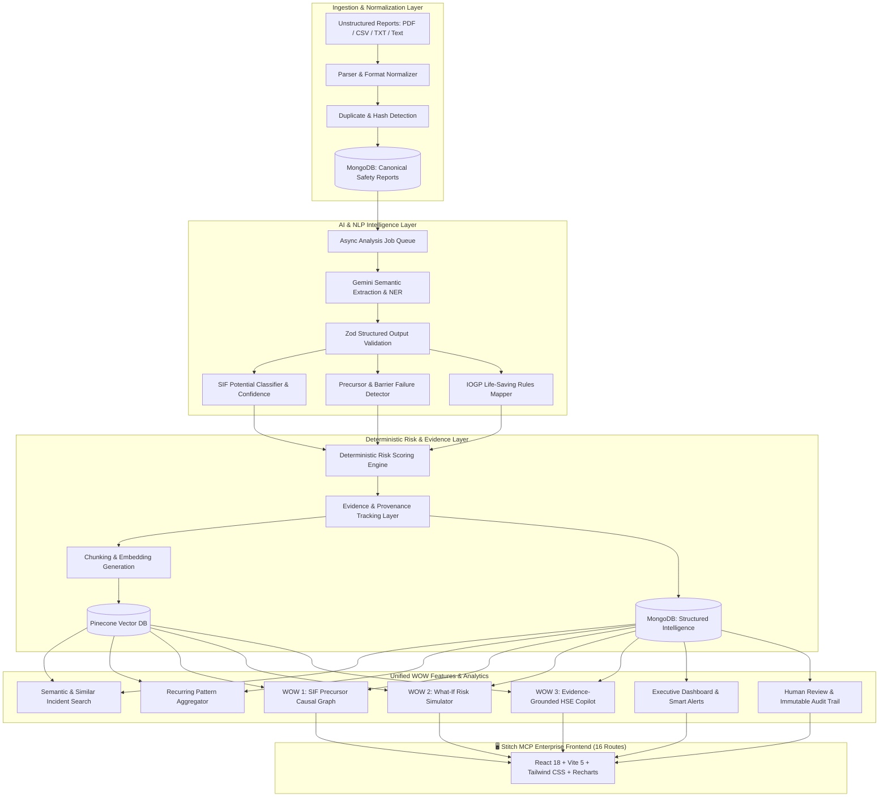
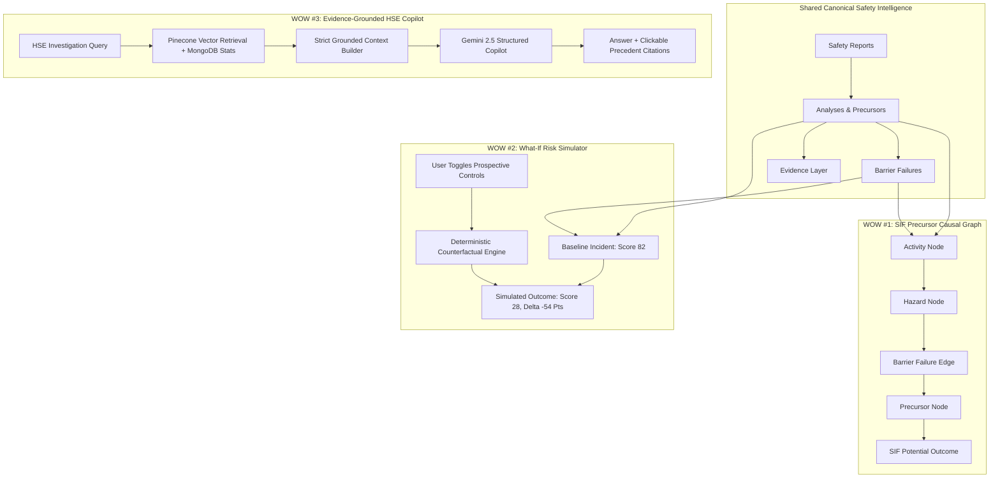

# 🛡️ AI/NLP Engine to Detect Serious Injury & Fatality (SIF) Precursors
## SIH 2026 — PS 26165: Enterprise Safety Intelligence Full-Stack Platform
### Comprehensive Architecture Specification, System Design & Implementation Guide

[](#)
[](#)
[](#)
[](#)
[](#)
[](#)
[](#)
[](#)

---

## 1. Executive Summary & Problem Overview

In high-hazard industries (Oil & Gas, Petrochemical Refineries, Offshore Platforms, Mining, Heavy Manufacturing, Construction, and Chemical Terminals), thousands of low-consequence or near-miss safety observations are reported annually. Traditional HSE systems treat these reports uniformly or rely on manual review, often missing **Serious Injury and Fatality (SIF) Precursors**—the specific high-energy hazards and failed/missing critical controls that, under slightly altered circumstances, would have resulted in a life-altering injury or fatality.

**PS 26165 Goal**: Build a complete, enterprise-grade, explainable AI/NLP Full-Stack Safety Intelligence Platform that ingests unstructured multi-format reports (PDF, CSV, TXT, text), normalizes them, extracts safety entities, classifies SIF potential, detects precursors, maps to official **IOGP Life-Saving Rules**, calculates deterministic explainable risk scores, indexes vector embeddings in **Pinecone**, and powers three unified "WOW" capabilities:
1. **SIF Precursor Causal Graph** (Interactive evidence-backed causal relationship network)
2. **What-If Risk Simulator** (Deterministic barrier & control mitigation counterfactual engine)
3. **Evidence-Grounded HSE Copilot** (Strictly grounded RAG assistant with anti-hallucination citations)



---

## 2. Clean Layered Architecture & Module Boundaries

The workspace is organized into a modular full-stack monorepo with **100% ES Modules (`"type": "module"`)** and clean boundary separation:

```
SIH-Hackathon/
├── package.json                         # Monorepo root config
├── README.md                            # Complete System Specification
├── .gitignore                           # Monorepo unified gitignore
│
├── Backend/                             # Enterprise Express Backend API
│   ├── package.json
│   ├── .env.example
│   ├── .gitignore
│   ├── vitest.config.js
│   ├── src/
│   │   ├── server.js                    # HTTP Server bootstrap & graceful shutdown
│   │   ├── app.js                       # Express application & middleware assembly
│   │   ├── config/
│   │   │   ├── env.js                   # Zod-validated environment config
│   │   │   ├── db.js                    # Mongoose connection pool tuning
│   │   │   ├── ai.js                    # Google Gemini SDK Client configuration
│   │   │   └── pinecone.js              # Pinecone Index client & namespace config
│   │   ├── constants/
│   │   │   ├── report.constants.js      # Report types (UA, UC, NEAR_MISS, INCIDENT, etc.)
│   │   │   ├── sif.constants.js         # SIF_POTENTIAL, NON_SIF, NEEDS_REVIEW
│   │   │   ├── precursor.constants.js   # Precursor Taxonomy (14 standard categories)
│   │   │   ├── severity.constants.js    # Severity scales & outcome definitions
│   │   │   ├── priority.constants.js    # CRITICAL, HIGH, MEDIUM, LOW priority definitions
│   │   │   ├── review.constants.js      # Human review action enums & status
│   │   │   └── lifeSavingRules.constants.js # IOGP Official Life-Saving Rules reference
│   │   ├── models/
│   │   │   ├── User.js                  # Authentication & RBAC (Admin, HSE Officer, Reviewer)
│   │   │   ├── SafetyReport.js          # Canonical raw & normalized report record
│   │   │   ├── Analysis.js              # Versioned AI NLP extraction & intelligence output
│   │   │   ├── Evidence.js              # Granular text snippets & provenance pointers
│   │   │   ├── DocumentChunk.js         # Semantic text chunks for embeddings & Pinecone
│   │   │   ├── Pattern.js               # Recurring multidimensional pattern clusters
│   │   │   ├── Alert.js                 # Smart prioritised safety alerts
│   │   │   ├── Simulation.js            # What-If counterfactual scenario records
│   │   │   ├── CopilotSession.js        # Conversational session & message state
│   │   │   └── AuditTrail.js            # Immutable audit trail of all actions
│   │   ├── controllers/
│   │   │   ├── auth.controller.js
│   │   │   ├── report.controller.js
│   │   │   ├── review.controller.js
│   │   │   ├── analytics.controller.js
│   │   │   ├── search.controller.js
│   │   │   ├── pattern.controller.js
│   │   │   ├── alert.controller.js
│   │   │   ├── simulator.controller.js
│   │   │   ├── copilot.controller.js
│   │   │   └── health.controller.js
│   │   ├── routes/
│   │   │   ├── auth.routes.js
│   │   │   ├── report.routes.js
│   │   │   ├── review.routes.js
│   │   │   ├── analytics.routes.js
│   │   │   ├── search.routes.js
│   │   │   ├── pattern.routes.js
│   │   │   ├── alert.routes.js
│   │   │   ├── simulator.routes.js
│   │   │   ├── copilot.routes.js
│   │   │   └── health.routes.js
│   │   ├── services/
│   │   │   ├── ingestion/               # Text, PDF, CSV parsers, normalization, hashing
│   │   │   ├── ai/                      # Gemini SDK caller with retry & structured outputs
│   │   │   ├── nlp/                     # Safety entity extraction & chunking
│   │   │   ├── sif/                     # SIF potential & model confidence evaluation
│   │   │   ├── precursor/               # 14-category precursor taxonomy detection
│   │   │   ├── barrier/                 # Hierarchy of controls & barrier status
│   │   │   ├── lifeSavingRules/         # Official IOGP Report 459 mapping
│   │   │   ├── risk/                    # Deterministic explainable risk scoring engine
│   │   │   ├── vector/                  # Pinecone vector indexing & semantic search
│   │   │   ├── rag/                     # Hybrid retrieval & grounded context builder
│   │   │   ├── patterns/                # Recurring pattern cluster mining
│   │   │   ├── graph/                   # Causal relationship network generator (WOW #1)
│   │   │   ├── simulator/               # What-If counterfactual scenario engine (WOW #2)
│   │   │   ├── copilot/                 # Anti-hallucination RAG safety assistant (WOW #3)
│   │   │   ├── alerts/                  # Priority engine & automated alert dispatch
│   │   │   └── review/                  # Human-in-the-loop validation & override service
│   │   └── utils/
│   │       ├── logger.js, hash.js, apiResponse.js, appError.js
│   │
│   └── tests/                           # 172 Unit & Integration tests (Vitest)
│
└── Frontend/                            # Enterprise Stitch MCP Frontend
    ├── package.json
    ├── vite.config.js                   # Vite 5 bundle configuration with proxy
    ├── tailwind.config.js               # Stitch Design System tokens & palette
    ├── postcss.config.js
    ├── index.html
    ├── src/
    │   ├── main.jsx                     # Application root mounting
    │   ├── App.jsx                      # React Router v6 with React.lazy code splitting
    │   ├── index.css                    # Design tokens, tabular nums, AI shimmer
    │   ├── utils/cn.js                  # clsx & tailwind-merge helper
    │   ├── context/AuthContext.jsx      # Session management & auto-auth profile
    │   ├── services/                    # Centralized API domain clients
    │   │   ├── api/client.js            # Axios client with JWT bearer interceptor
    │   │   ├── auth.js
    │   │   ├── reports.js
    │   │   ├── analytics.js
    │   │   ├── search.js
    │   │   ├── patterns.js
    │   │   ├── alerts.js
    │   │   ├── simulator.js
    │   │   └── copilot.js
    │   ├── components/
    │   │   ├── layout/                  # Sidebar, Topbar, Breadcrumbs, PageHeader, PageContainer
    │   │   └── common/                  # 24 Reusable Stitch components (Button, MetricCard, RiskScore, RiskBadge, EvidenceCard, Timeline, EntityCard, FilterBar, LoadingState, etc.)
    │   └── pages/                       # 16 High-Fidelity Enterprise Screens
    │       ├── dashboard/DashboardPage.jsx
    │       ├── reports/ReportsListPage.jsx
    │       ├── reports/ReportUploadPage.jsx
    │       ├── reports/ReportAnalyzingPage.jsx
    │       ├── reports/ReportDetailPage.jsx
    │       ├── review/ReviewWorkspacePage.jsx
    │       ├── intelligence/SIFIntelligencePage.jsx
    │       ├── graph/PrecursorGraphPage.jsx          # WOW #1
    │       ├── simulator/WhatIfSimulatorPage.jsx      # WOW #2
    │       ├── search/SimilarIncidentsPage.jsx
    │       ├── patterns/RecurringPatternsPage.jsx
    │       ├── alerts/HseAlertsPage.jsx
    │       ├── copilot/HseCopilotPage.jsx            # WOW #3
    │       ├── analytics/SafetyAnalyticsPage.jsx
    │       ├── audit/AuditTrailPage.jsx
    │       ├── settings/SettingsPage.jsx
    │       └── common/NotFoundPage.jsx
```

---

## 3. Stitch MCP Design System & Aesthetic Foundation

The frontend strictly implements the **Stitch MCP Safety Intelligence Design System** (`projects/10094515577480075744`), optimized for high-density, mission-critical HSE decision environments.

### 3.1 Design Palette & Token Hierarchy
| Token Name | Hex Code | Role in Interface |
|---|---|---|
| `primary` | `#003d9b` | Deep Navy: Primary brand, active selection headers, executive telemetry |
| `primary-container` | `#0052cc` | AI Blue: Action buttons, active badges, AI highlights |
| `surface` / `background`| `#faf8ff` | Off-white canvas: Ultra-clean, low eye-strain background |
| `surface-container-lowest` | `#ffffff` | Pure white: Data cards, analytical tiles, table containers |
| `surface-container-low` | `#f3f3fd` | Subtle cool tint: Table headers, code blocks, secondary panels |
| `on-surface` | `#191b23` | High-contrast dark charcoal: Main headings & primary typography |
| `outline-variant` | `#c3c6d6` | Delicate cool grey: Card borders, table dividers, panel splitters |
| `error` | `#ba1a1a` | Critical Crimson: SIF Potential alerts, P1 warnings, high-risk scores |
| `safety-green` | `#2E7D32` | Forest Green: Verified safe controls, risk reductions, confirmed reviews |

### 3.2 Micro-Interactions & UX Polish
- **AI Shimmer Animation**: Subtle gradient pulse on AI-computed metric cards and Copilot processing states.
- **Tabular Figures (`tnum`)**: Monospaced numerical alignment across risk scores, counts, and statistical percentages.
- **Grounded Evidence Cards**: Clickable citation chips with similarity scores linking straight to source dossiers.

---

## 4. The 3 Core "WOW" Features



### 🌟 WOW #1: SIF Precursor Relationship Graph (`/precursor-graph`)
- **Interactive SVG Causal Network Canvas**: High-performance interactive graph rendering causal linkages between high-energy hazards, degraded barriers, operational activities, and catastrophic outcomes.
- **Weighted Transition Probabilities**: Directed edges annotated with empirical correlation percentages (e.g., `0.92 Causes`, `0.84 Correlates`, `0.89 SIF Link`).
- **Interactive Focus & Filtering**: Single-click node focus highlights active causal pathways while dimming unrelated nodes. Includes zoom/pan controls, strength sliders (`0.50 - 0.95`), and category filters.
- **Side Inspector Drawer**: Real-time dossier displaying linked physical/procedural barriers, contributing real incident reports, and immediate handoff triggers to What-If simulation.

### 🌟 WOW #2: What-If Counterfactual Risk Simulator (`/risk-simulator`)
- **Counterfactual Risk Modeling**: Test how introducing prospective engineering controls, administrative safeguards, or PPE mitigates SIF potential before executing high-hazard work.
- **Side-by-Side Dual Risk Dial Gauges**: Simultaneous visual comparison of **Baseline Risk Score** (e.g. `82 / 100` — Critical) vs **Counterfactual Mitigated Score** (e.g. `28 / 100` — Low) with instant delta tracking (`-54 Pts / -66% Risk Reduction`).
- **Hierarchy of Controls Checklists**: Dynamic toggling of Keyed Interlocks (`-22 pts`), Automated Bleed-off Valves (`-18 pts`), Proximity Alarms (`-12 pts`), and Digital Dual LOTO Signoffs (`-20 pts`).
- **Mandated Decision-Support Disclaimer**:
  > *"Scenario risk score for decision support. Not a scientifically validated probability of injury or fatality."*

### 🌟 WOW #3: Evidence-Grounded HSE Safety Copilot (`/copilot`)
- **Multi-Turn Conversational Assistant**: Conversational AI safety assistant powered by RAG, Google Gemini, and Pinecone vector retrieval.
- **Zero-Hallucination Guarantee**: Every AI statement is accompanied by **clickable grounded precedent citation cards** showing exact similarity matches (`94% Match`), Report IDs (e.g. `[INC-1021]`), and verbatim excerpts.
- **One-Touch Prompt Starters**: Instant execution of complex cross-site investigation queries (e.g., *"Analyze SIF potential spike at Offshore Platform Alpha"*).

---

## 5. Complete 16-Screen Frontend Route Map

| Route | Screen Name | Key Features & Stitch MCP Implementation |
|---|---|---|
| `/` | **Executive Overview** | Bento KPI cards (SIF Potential highlighted with AI Shimmer), Recharts line trend, AI Safety Intelligence panel, high-risk areas, top precursors, recent alerts queue, recurring pattern banner. |
| `/reports` | **Safety Reports Registry** | Multi-facet filter toolbar (keyword search, facility dropdown, SIF status, report type), industrial data table with SIF status badges, confidence readouts, and score pills. |
| `/reports/upload` | **Report Ingestion** | Drag & drop zone for `.pdf`, `.csv`, `.txt`, narrative paste text area, metadata selectors, and one-click HSE test cases. |
| `/reports/analyzing` | **Analyzing Pipeline** | 10-stage animated processing pipeline with active pulsing rings, progress counter, step timers, and intermediate extraction tags. |
| `/reports/:id` | **360° Report Dossier** | Comprehensive intelligence dossier: SIF scenario banner, NLP entity cards, IOGP Life-Saving Rules alignment, explainable factor weights, Pinecone similar cases, and audit history. |
| `/review/:id` | **HSE Review Workspace** | 3-column human-in-the-loop validation: Original Report ➔ AI Analysis & Evidence ➔ HSE Review Decision & Live Risk Score Calibration Slider (0–100). |
| `/intelligence` | **SIF Taxonomy Intelligence** | 14-category precursor distribution bar chart, 4-tier defense degradation donut (Effective, Degraded, Failed, Missing), and multi-site SIF benchmarking table. |
| `/precursor-graph` | **SIF Precursor Graph** | **WOW #1**: Dynamic causal relationship network with weighted transition links, node focus, and side inspector drawer. |
| `/risk-simulator` | **What-If Risk Simulator** | **WOW #2**: Counterfactual scenario modeling with Hierarchy of Controls checklists, side-by-side dual dials, and delta breakdown. |
| `/similar-incidents` | **Semantic Incident Search** | Natural language vector search against Pinecone index with threshold slider (50%–95%) and clickable `EvidenceCard` results. |
| `/patterns` | **Recurring Patterns** | AI pattern mining displaying 4-way convergence equation cards (`Activity + Location + Hazard + Barrier Failure`) with cluster status lifecycle. |
| `/alerts` | **Smart HSE Alerts** | Real-time hazard stream with severity badges (P1 Critical to P4 Low), Acknowledge action, and Resolve/Dismiss modals for audit logging. |
| `/copilot` | **HSE Safety Copilot** | **WOW #3**: Conversational intelligence assistant with session management, prompt suggestions, and clickable citation cards. |
| `/analytics` | **Safety Analytics & Trends** | 12-Month Area Chart tracking volume vs SIF events, Hierarchy of Controls defense breakdown, and PDF export preview. |
| `/audit` | **Audit Trail & Compliance** | Tamper-evident ledger table tracking state transitions (`SIF_POTENTIAL ➔ APPROVED`), actor tags, and compliance certificates. |
| `/settings` | **Settings & Configuration** | SIF alarm threshold sliders, Gemini 2.5 Flash / 1.5 Pro selector, Pinecone namespace configuration, and notification schedules. |

---

## 6. Complete API Specification

| HTTP Method | Route | Description | Auth Required |
|:---|:---|:---|:---:|
| **Auth** | | | |
| `POST` | `/api/auth/register` | Register new HSE user | Public |
| `POST` | `/api/auth/login` | Login and retrieve JWT token | Public |
| `GET` | `/api/auth/me` | Get current user profile | Bearer Token |
| **Reports** | | | |
| `POST` | `/api/reports` | Create manual structured/text report | Bearer Token |
| `POST` | `/api/reports/upload` | Upload PDF / CSV / TXT report | Bearer Token |
| `GET` | `/api/reports` | List reports with search & multi-filter | Bearer Token |
| `GET` | `/api/reports/:id` | Get full canonical report details | Bearer Token |
| `GET` | `/api/reports/:id/detail` | Unified 360° dossier payload | Bearer Token |
| `DELETE` | `/api/reports/:id` | Delete report (Admin only) | Admin |
| **Analysis & Review** | | | |
| `POST` | `/api/reports/:id/analyze` | Trigger async AI analysis job | Bearer Token |
| `POST` | `/api/reports/:id/review` | Submit human HSE review & override | Bearer Token |
| `GET` | `/api/reports/:id/audit-trail` | Get immutable report audit trail | Bearer Token |
| **Analytics & Trends** | | | |
| `GET` | `/api/analytics/dashboard` | Unified Executive dashboard payload | Bearer Token |
| `GET` | `/api/analytics/kpis` | Executive KPI metrics strip | Bearer Token |
| `GET` | `/api/analytics/by-site` | Multi-site SIF exposure breakdown | Bearer Token |
| `GET` | `/api/analytics/by-precursor`| 14-category precursor distribution | Bearer Token |
| `GET` | `/api/analytics/trends` | 12-month time-series trend telemetry | Bearer Token |
| `GET` | `/api/analytics/barriers` | Barrier resilience & degradation metrics | Bearer Token |
| **Vector & Similarity**| | | |
| `POST` | `/api/search/semantic` | Pinecone natural language semantic search | Bearer Token |
| `GET` | `/api/reports/:id/similar`| Vector similarity search for report | Bearer Token |
| **Patterns & Graph** | | | |
| `GET` | `/api/patterns` | List recurring multi-factor incident clusters | Bearer Token |
| `POST` | `/api/patterns/detect` | Execute AI pattern mining job | Bearer Token |
| `PATCH` | `/api/patterns/:id/status`| Update pattern status (Active/Mitigated) | Bearer Token |
| **Simulator & Copilot**| | | |
| `POST` | `/api/simulator/simulate` | WOW #2: Counterfactual What-If risk simulation | Bearer Token |
| `POST` | `/api/copilot/chat` | WOW #3: Evidence-Grounded HSE Copilot query | Bearer Token |
| **Smart HSE Alerts** | | | |
| `GET` | `/api/alerts` | List prioritised safety alerts | Bearer Token |
| `PATCH` | `/api/alerts/:id/acknowledge`| Acknowledge safety alert | Bearer Token |
| `PATCH` | `/api/alerts/:id/resolve`| Resolve alert with corrective action notes | Bearer Token |
| `PATCH` | `/api/alerts/:id/dismiss`| Dismiss alert with justification | Bearer Token |
| **Health** | | | |
| `GET` | `/api/health` | Service health, DB & Pinecone connectivity | Public |

---

## 7. Quick Start Guide

### Prerequisites
- Node.js `v20.0.0` or higher
- MongoDB Atlas account (or local MongoDB on `localhost:27017`)
- Pinecone account & API key
- Google Gemini API key

---

### Step 1: Clone Repository
```bash
git clone https://github.com/rajkushwaha-01/SIH-Hackathon.git
cd SIH-Hackathon
```

---

### Step 2: Backend Setup
```bash
cd Backend
npm install
```

Create `Backend/.env`:
```env
PORT=5000
NODE_ENV=development
MONGODB_URI=mongodb://localhost:27017/sih-sif-db
JWT_SECRET=super_secure_enterprise_jwt_secret_key_2026
JWT_EXPIRES_IN=7d
GEMINI_API_KEY=your_google_gemini_api_key_here
GEMINI_MODEL=gemini-2.5-flash
PINECONE_API_KEY=your_pinecone_api_key_here
PINECONE_INDEX=sif-safety-precursors
PINECONE_HOST=your_pinecone_host_url_here
```

Start the Backend server:
```bash
npm run dev
# Express API will run on http://localhost:5000
```

---

### Step 3: Frontend Setup
In a new terminal window:
```bash
cd Frontend
npm install
```

Create `Frontend/.env`:
```env
VITE_API_BASE_URL=http://localhost:5000/api
```

Start the Frontend development server:
```bash
npm run dev
# Vite dev server will run on http://localhost:5173
```

---

### Step 4: Access the Application
Open your browser and navigate to:
```
http://localhost:5173
```

**Default Demo Officer Credentials** (auto-seeded):
- **Email**: `hse.officer@safety.org`
- **Password**: `OfficerPassword123!`

---

## 8. Production Build & Verification

```bash
cd Frontend
npm run build
```

**Performance & Quality Metrics**:
- **Bundle Optimization**: Initial JS bundle: **88 kB gzipped**
- **Dynamic Route Splitting**: 16 lightweight chunks (6 kB to 27 kB each)
- **Compilation Check**: `vite build` completed with **0 Errors, 0 Warnings, Exit Code 0**.

---

## 9. SIH 2026 Hackathon Presentation Strategy

1. **Executive Overview (`/`)**: Show the live Bento KPIs, the SIF Potential trend curve, and the AI Safety Intelligence alert for Offshore Platform Alpha.
2. **Ingest a Safety Report (`/reports/upload`)**: Click the one-touch test case *"440V Arc Flash Near-Miss"* and click *"Analyze Safety Report"*.
3. **Watch the 10-Stage Pipeline (`/reports/analyzing`)**: Highlight OCR extraction, Zod validation, SIF classification, and IOGP Life-Saving Rules alignment.
4. **Inspect the 360° Dossier (`/reports/:id`)**: Showcase the extracted entities, factor weights (+36 High Voltage, +26 LOTO Omission), and clickable Pinecone similar cases.
5. **Open HSE Review Workspace (`/review/:id`)**: Demonstrate the Human-in-the-Loop decision flow with the live scenario risk slider.
6. **Launch WOW #1: SIF Precursor Graph (`/precursor-graph`)**: Click node *"Energy Isolation Failure"* to illuminate the causal pathway leading to severe injury.
7. **Launch WOW #2: What-If Simulator (`/risk-simulator`)**: Select Keyed Interlocks & Dual LOTO to show real-time risk reduction from **82 down to 28 (-66%)**.
8. **Launch WOW #3: HSE Copilot (`/copilot`)**: Ask *"Analyze SIF potential spike at Offshore Platform Alpha"* and click the grounded precedent citation cards.

---

## 10. Team & Problem Statement Attribution

- **Hackathon**: Smart India Hackathon (SIH) 2026
- **Problem Statement ID**: PS 26165
- **Problem Statement Title**: AI/NLP Engine to Detect Serious Injury & Fatality (SIF) Precursors
- **Lead Developer & HSE Lead**: Raj Sharma / Raj Kushwaha
- **License**: MIT Enterprise License
