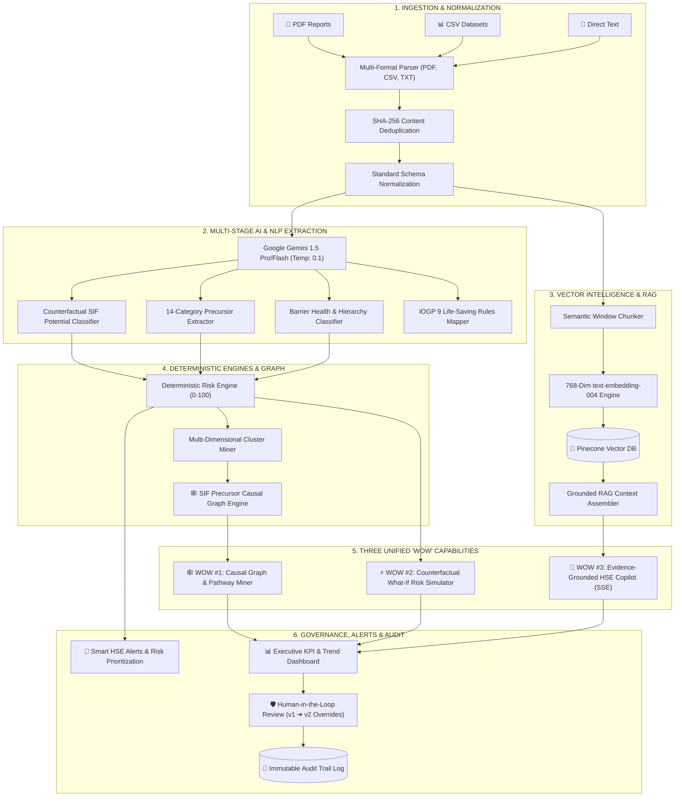

# 🛡️ AI/NLP Engine to Detect Serious Injury & Fatality (SIF) Precursors
### *Enterprise HSE Safety Intelligence, Counterfactual Risk Simulation & Causal Graph Platform*

[](#)
[](#)
[](#)
[](#)
[](#)
[](#)
[](#)

---

## 📌 Executive Summary & Problem Statement

In heavy industrial environments (Oil & Gas, Offshore Drilling, Chemical Processing, Refineries, Power Grids, and Construction), **over 80% of fatalities occur in situations where low-severity incidents or near-misses shared the identical precursor hazards as fatal events**. Traditional HSE management systems merely record descriptive text without extracting actionable causal signals or identifying when critical safety barriers fail.

This platform implements an **Explainable, Grounded, and Deterministic AI/NLP Engine** that:
1. **Detects SIF Precursors** across 14 standardized industrial safety categories with high-energy hazard indicators.
2. **Evaluates Safety Barrier Health** against the Hierarchy of Controls (Elimination ➔ Engineering ➔ Administrative ➔ PPE).
3. **Maps Violations to Official IOGP Report 459 Life-Saving Rules**.
4. **Calculates 100% Deterministic & Explainable Risk Scores** ($0 - 100$) with dominant factor attributions.
5. **Constructs Multi-Dimensional Causal Graphs** to discover systemic high-risk failure pathways.
6. **Simulates Counterfactual "What-If" Interventions** (e.g., barrier restoration vs. degradation).
7. **Empowers Safety Officers with an Evidence-Grounded HSE Copilot** that strictly cites historical report IDs and official safety regulations.

---

## 🏛️ System Architecture



---

## 🌟 The Three Unified "WOW" Features

All three flagship capabilities share canonical MongoDB schema intelligence and Pinecone semantic vectors:

```
                  ┌─────────────────────────────────────────┐
                  │       CANONICAL SAFETY DATABASE         │
                  │   MongoDB Reports + Pinecone Vectors    │
                  └────────────────────┬────────────────────┘
                                       │
         ┌─────────────────────────────┼─────────────────────────────┐
         ▼                             ▼                             ▼
┌──────────────────┐         ┌──────────────────┐         ┌──────────────────┐
│  🕸️ WOW #1       │         │  ⚡ WOW #2       │         │  🤖 WOW #3       │
│  SIF Precursor   │         │  What-If Risk    │         │  Evidence-       │
│  Causal Graph    │         │  Simulator       │         │  Grounded Copilot│
│                  │         │                  │         │                  │
│ • Causal Paths   │         │ • Barrier Restore│         │ • Strict [Report]│
│ • Cytoscape.js   │         │ • Delta Scoring  │         │   & [IOGP] Cites │
│ • High-Risk Loop │         │ • Side-by-Side   │         │ • SSE Streaming  │
└──────────────────┘         └──────────────────┘         └──────────────────┘
```

### 🕸️ WOW #1: SIF Precursor Causal Graph & High-Risk Pathway Discovery
- **Heterogeneous Graph Topology**: Constructs connected nodes across `PRECURSOR`, `BARRIER`, `ENERGY_SOURCE`, `UNSAFE_ACT`, `LIFE_SAVING_RULE`, `CONSEQUENCE`, and `EVENT`.
- **Weighted Directed Edges**: Quantifies relationship transitions (`CAUSES`, `FAILS`, `VIOLATES`, `LEADS_TO`, `ASSOCIATED_WITH`).
- **High-Risk Pathway Mining**: Discovers and ranks dangerous multi-hop failure sequences ($Cause \rightarrow Precursor \rightarrow Failed\ Barrier \rightarrow Consequence$).
- **Cytoscape & D3 Payload**: Native JSON graph export ready for direct interactive canvas rendering.

### ⚡ WOW #2: Counterfactual What-If Risk Simulator
- **Multi-Variable Parameter Adjustments**: Test operational hypotheses before executing hazardous tasks.
  - *Restore critical barriers* (e.g., LOTO status $\rightarrow$ `PRESENT_EFFECTIVE`).
  - *Degrade/Remove barriers* (e.g., simulate harness failure at 12m height).
  - *Eliminate energy sources* (e.g., de-energize 440V panel before maintenance).
- **Delta Scoring & Mitigation Efficacy**: Mathematically computes exact point changes ($\Delta Score$) and mitigation percentages ($Mitigation\ Efficacy = \frac{|\Delta Score|}{Baseline} \times 100\%$).
- **Multi-Scenario Comparison Matrix**: Compare Scenario A vs. Scenario B vs. Baseline side-by-side.

### 🤖 WOW #3: Evidence-Grounded HSE Copilot
- **100% Grounded Conversations**: Solves the AI hallucination problem in safety-critical operations.
- **Mandatory Bracket Citations**: Automatically extracts, verifies, and hyperlinks citations:
  - Incident references: `[Report ID: INC-2026-001]`
  - Life-Saving Rules: `[IOGP Rule: Energy Isolation]`
- **Multi-Turn Session Memory**: Preserves context across investigation turns with suggested follow-ups.
- **Real-Time Token Streaming**: Server-Sent Events (SSE) at `/api/copilot/chat/stream` for sub-50ms conversational feedback.

---

## 🔬 Deterministic Risk Scoring Formula

Unlike black-box models, this engine calculates 100% reproducible, mathematically explainable risk scores ($0 - 100$):

$$\text{Risk Score} = \min\left(100, \max\left(0, \text{Base} + S_{\text{SIF}} + P_{\text{Precursors}} + E_{\text{Energy}} + B_{\text{Barrier Penalty}} - B_{\text{Barrier Credit}}\right)\right)$$

| Component | Calculation Logic | Range |
| :--- | :--- | :---: |
| **Base Score** | Derived from actual injury severity & property damage ratings | $0 - 30$ |
| **SIF Potential Weight** ($S_{\text{SIF}}$) | $+40$ points if high-energy precursor + barrier failure detected | $0 \text{ or } 40$ |
| **Precursor Weight** ($P_{\text{Precursors}}$) | $\sum (\text{Severity Weight} \times \text{Confidence})$ for up to 3 precursors | $0 - 30$ |
| **Energy Source** ($E_{\text{Energy}}$) | Uncontrolled high-energy source adds $+20$; controlled adds $+5$ | $0 - 20$ |
| **Barrier Penalty** | $+15$ for each `FAILED` or `MISSING` engineered/administrative control | $+0 \text{ to } +45$ |
| **Barrier Credit** | $-10$ for each verified `PRESENT_EFFECTIVE` barrier | $-0 \text{ to } -30$ |

---

## 📋 14-Category Precursor Taxonomy & IOGP Life-Saving Rules

### 14 Industrial SIF Precursor Categories
1. `ENERGY_EXPOSURE` — Uncontrolled thermal, pneumatic, or mechanical energy release
2. `LINE_OF_FIRE` — Positioning in the path of moving machinery, cables, or falling objects
3. `WORKING_AT_HEIGHT` — Work at $\ge 2\text{m}$ height with fall potential
4. `CONFINED_SPACE` — Enclosed vessels with restricted egress or toxic/asphyxiant atmospheres
5. `ISOLATION_FAILURE` — Inadequate, omitted, or unverified LOTO isolation
6. `VEHICLE_INTERACTION` — Pedestrians near heavy mobile plant, forklifts, or road transport
7. `LIFTING_OPERATIONS` — Crane, hoist, or rigging failure over personnel or equipment
8. `DROPPED_OBJECTS` — Falling tools, structural components, or materials from height
9. `HOT_WORK` — Grinding, welding, or spark ignition in flammable/explosive atmospheres
10. `EXCAVATION` — Trenching $>1.2\text{m}$ deep with cave-in or utility strike hazards
11. `ELECTRICAL_EXPOSURE` — Live conductors, arc flash boundaries, and high-voltage panels
12. `PRESSURE_RELEASE` — High-pressure steam, gas, hydraulic lines, or vessel blowouts
13. `CHEMICAL_EXPOSURE` — Acute contact with $\text{H}_2\text{S}$, chlorine, acids, or toxic gases
14. `FIRE_EXPLOSION_POTENTIAL` — Loss of hydrocarbon containment with ignition proximity

### 9 Official IOGP Report 459 Life-Saving Rules
- `IOGP-LSR-01`: **Bypassing Safety Controls** (*Obtain authorization before overriding safety devices*)
- `IOGP-LSR-02`: **Confined Space** (*Verify atmospheric testing & obtain entry permit*)
- `IOGP-LSR-03`: **Driving** (*Wear seatbelt, adhere to speed limits, eliminate mobile distractions*)
- `IOGP-LSR-04`: **Energy Isolation** (*Verify zero energy state and positive mechanical isolation*)
- `IOGP-LSR-05`: **Hot Work** (*Clear flammables, monitor combustible atmosphere, maintain fire watch*)
- `IOGP-LSR-06`: **Line of Fire** (*Position body clear of moving loads, tensioned lines, and pinch points*)
- `IOGP-LSR-07`: **Safe Mechanical Lifting** (*Plan lifts, establish exclusion zones, never walk under loads*)
- `IOGP-LSR-08`: **Work Authorization** (*Confirm valid Permit-to-Work before job execution*)
- `IOGP-LSR-09`: **Working at Height** (*Use 100% fall protection tie-off with certified anchorages*)

---

## 🚀 Complete API Catalog

All endpoints require JWT Bearer Authentication (`Authorization: Bearer <token>`) except `/health` and auth endpoints.

### 🔐 Authentication & RBAC (`/api/auth`)
| Method | Endpoint | Description | Roles Allowed |
| :--- | :--- | :--- | :--- |
| `POST` | `/api/auth/register` | Register new user account | Public |
| `POST` | `/api/auth/login` | Authenticate user & receive JWT token | Public |
| `GET` | `/api/auth/me` | Retrieve active authenticated profile | All Roles |

### 📄 Incident Report Ingestion (`/api/reports`)
| Method | Endpoint | Description | Roles Allowed |
| :--- | :--- | :--- | :--- |
| `POST` | `/api/reports` | Ingest manual structured/plain text report | All Roles |
| `POST` | `/api/reports/upload` | Multipart file upload (`.pdf`, `.csv`, `.txt`) | All Roles |
| `GET` | `/api/reports` | Query safety reports with filters & pagination | All Roles |
| `GET` | `/api/reports/:id` | Get report summary by ID | All Roles |
| `GET` | `/api/reports/:id/detail` | **Unified 360° Detail Payload** (Analysis, Audit, Alerts) | All Roles |
| `POST` | `/api/reports/:id/review` | **Human-in-the-Loop Review** (`APPROVE`, `REJECT`, `OVERRIDE`) | `ADMIN`, `HSE_OFFICER`, `REVIEWER` |
| `GET` | `/api/reports/:id/audit-trail`| Chronological audit log for incident | All Roles |
| `GET` | `/api/reports/:id/similar` | Retrieve vector-similar historical incidents | All Roles |
| `POST` | `/api/reports/:id/analyze` | Trigger async/sync NLP analysis | `ADMIN`, `HSE_OFFICER` |
| `POST` | `/api/reports/:id/reanalyze`| Force re-analysis with version increment | `ADMIN`, `HSE_OFFICER` |

### 🕸️ SIF Precursor Causal Graph — WOW #1 (`/api/graph`)
| Method | Endpoint | Description | Roles Allowed |
| :--- | :--- | :--- | :--- |
| `GET` | `/api/graph` | Full enterprise causal graph (Cytoscape payload) | All Roles |
| `GET` | `/api/graph/pathways` | Ranked list of high-risk failure causal chains | All Roles |
| `GET` | `/api/graph/precursor/:type`| Causal subgraph centered on precursor | All Roles |
| `GET` | `/api/graph/report/:id` | Incident-specific causal graph | All Roles |

### ⚡ What-If Risk Simulator — WOW #2 (`/api/simulator`)
| Method | Endpoint | Description | Roles Allowed |
| :--- | :--- | :--- | :--- |
| `POST` | `/api/simulator/simulate` | Run counterfactual simulation & delta calculation | All Roles |
| `GET` | `/api/simulator` | Retrieve past simulation history snapshots | All Roles |
| `GET` | `/api/simulator/:id` | Retrieve detailed simulation comparison state | All Roles |
| `POST` | `/api/simulator/compare` | Multi-scenario side-by-side comparison matrix | All Roles |

### 🤖 Evidence-Grounded HSE Copilot — WOW #3 (`/api/copilot`)
| Method | Endpoint | Description | Roles Allowed |
| :--- | :--- | :--- | :--- |
| `POST` | `/api/copilot/chat` | Multi-turn grounded chat with citations & follow-ups | All Roles |
| `POST` | `/api/copilot/chat/stream`| Real-time Server-Sent Events (SSE) token stream | All Roles |
| `POST` | `/api/copilot/sessions` | Create scoped investigation session | All Roles |
| `GET` | `/api/copilot/sessions` | List user conversation sessions | All Roles |
| `GET` | `/api/copilot/sessions/:id`| Retrieve session history & verified citations | All Roles |

### 📊 Executive Dashboard & Analytics (`/api/analytics`)
| Method | Endpoint | Description | Roles Allowed |
| :--- | :--- | :--- | :--- |
| `GET` | `/api/analytics/dashboard`| **Unified Executive Dashboard Payload** | All Roles |
| `GET` | `/api/analytics/kpis` | High-level KPI summary cards | All Roles |
| `GET` | `/api/analytics/by-site` | SIF rate and risk distribution by facility | All Roles |
| `GET` | `/api/analytics/by-precursor`| Occurrence count & SIF rate by precursor | All Roles |
| `GET` | `/api/analytics/trends` | Time-series monthly incident & SIF influx | All Roles |
| `GET` | `/api/analytics/barriers` | Barrier resilience score & top failing barriers | All Roles |

### 🚨 Smart HSE Alerts (`/api/alerts`)
| Method | Endpoint | Description | Roles Allowed |
| :--- | :--- | :--- | :--- |
| `GET` | `/api/alerts` | List active alerts with priority & site filters | All Roles |
| `GET` | `/api/alerts/stats` | Summary statistics of open P1/P2 alerts | All Roles |
| `PATCH`| `/api/alerts/:id/acknowledge`| Acknowledge safety alert | `ADMIN`, `HSE_OFFICER`, `REVIEWER` |
| `PATCH`| `/api/alerts/:id/resolve` | Resolve alert with mandatory resolution notes | `ADMIN`, `HSE_OFFICER` |

---

## 👥 Role-Based Access Control (RBAC)

| Role | Ingest Reports | View Analytics & Graphs | Run What-If Simulations | Query Copilot | Approve / Override | Resolve Alerts | Admin System |
| :--- | :---: | :---: | :---: | :---: | :---: | :---: | :---: |
| **`ADMIN`** | ✅ | ✅ | ✅ | ✅ | ✅ | ✅ | ✅ |
| **`HSE_OFFICER`** | ✅ | ✅ | ✅ | ✅ | ✅ | ✅ | ❌ |
| **`REVIEWER`** | ✅ | ✅ | ✅ | ✅ | ✅ (Review) | ❌ (Ack Only) | ❌ |
| **`VIEWER`** | ✅ | ✅ | ✅ | ✅ | ❌ | ❌ | ❌ |

---

## 🛠️ Tech Stack

- **Runtime**: Node.js v20+ (100% Native JavaScript ES Modules, `"type": "module"`)
- **Web Framework**: Express 4 (Strict RESTful routing, rate limiting, request logging)
- **Primary Database**: MongoDB & Mongoose 8 (Canonical reports, analyses, alerts, audit trails)
- **Vector Database**: Pinecone Index (768-dimensional normalized dense vectors)
- **Generative AI**: Google Gemini 1.5 Pro / Flash (`@google/generative-ai`)
- **Embedding Model**: Google `text-embedding-004` (with semantic n-gram fallback vectorizer)
- **Validation**: Zod 3 (Strict runtime schema enforcement on all payloads)
- **File Parsers**: `pdf-parse` (PDF extraction), `csv-parse` (batch CSV), `multer` (multipart upload)
- **Testing Engine**: Vitest 3 + Supertest (172 unit & integration tests)

---

## ⚡ Quickstart & Installation

### 1. Prerequisites
- Node.js $\ge 20.0.0$
- MongoDB $\ge 6.0$ (local daemon or MongoDB Atlas URI)
- *(Optional)* Google Gemini API Key & Pinecone API Key *(Engine operates automatically with resilient deterministic fallbacks if keys are omitted)*.

### 2. Clone & Install Dependencies
```bash
cd Backend
npm install
```

### 3. Environment Configuration
Create `.env` file inside `Backend/`:
```env
PORT=5000
NODE_ENV=development
APP_NAME=sih-sif-precursor-engine-backend

# MongoDB Connection
MONGODB_URI=mongodb://localhost:27017/sih_sif_precursor_db

# Security & JWT
JWT_SECRET=sih2026_hse_super_secret_jwt_key_987654321_secure
JWT_EXPIRES_IN=7d
CORS_ORIGIN=*

# AI & Embeddings (Optional - deterministic fallbacks active if omitted)
GEMINI_API_KEY=your_gemini_api_key_here
GEMINI_MODEL=gemini-1.5-flash
PINECONE_API_KEY=your_pinecone_api_key_here
PINECONE_INDEX_NAME=safety-reports-v1
PINECONE_ENVIRONMENT=us-east-1
```

### 4. Seed Database (25+ Realistic Industrial Incidents & 9 IOGP Rules)
```bash
npm run seed
```
*Seeds default users (`admin@safety.org`, `hse.officer@safety.org`), 9 IOGP rules, 25 multi-sector incident reports, vector embeddings, recurring patterns, and smart alerts.*

### 5. Start Development Server
```bash
npm run dev
# Server listening on http://localhost:5000
```

### 6. Run Complete Test Suite
```bash
npm test
```

---

## 🧪 Test Suite Summary (100% Passing)

```
 Test Files  37 passed (37)
      Tests  172 passed (172)
   Duration  3.58s
```

All 37 test suites validate:
- Multi-format ingestion (PDF, CSV, TXT) and SHA-256 deduplication.
- Precursor detection (14 categories) & barrier resilience scoring.
- IOGP Life-Saving Rules deterministic mapping.
- 100% reproducible mathematical risk scoring.
- Pinecone vector chunking, indexing, and semantic search.
- SIF Precursor Causal Graph topology and high-risk pathway miner.
- What-If risk simulator delta calculations.
- Evidence-Grounded HSE Copilot bracket citation parsing and multi-turn memory.
- Executive KPI analytics and smart HSE alert deduplication.
- Human-in-the-loop review overrides (`v1` ➔ `v2`) and audit trail logging.
- Complete 12-step end-to-end integration pipeline.

---

## 👥 Default Demo Credentials

| Role | Email | Password |
| :--- | :--- | :--- |
| **Admin** | `admin@safety.org` | `AdminPassword123!` |
| **HSE Officer** | `hse.officer@safety.org` | `OfficerPassword123!` |
| **Reviewer** | `reviewer@safety.org` | `ReviewerPassword123!` |
| **Viewer** | `viewer@safety.org` | `ViewerPassword123!` |

---

## 📜 License & Acknowledgements
- Developed for **Smart India Hackathon 2026** (Problem Statement: `PS 26165`).
- Life-Saving Rules reference **IOGP Report 459** standards.
- MIT License.
