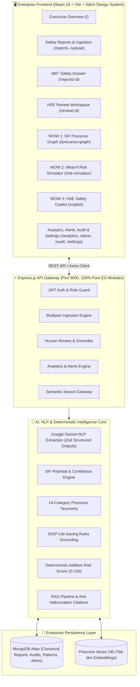

# 🛡️ AI/NLP Engine to Detect Serious Injury & Fatality (SIF) Precursors
## Smart India Hackathon 2026 — Problem Statement 26165
### Complete Enterprise Safety Intelligence Full-Stack Platform (Backend + Frontend MVP)

[](#)
[](#)
[](#)
[](#)
[](#)
[](#)
[](#)
[](#)

---

## 1. Executive Summary & Problem Context

In heavy industrial environments (Oil & Gas, Petrochemical Refineries, Offshore Platforms, Mining, Construction, and Chemical Terminals), thousands of low-severity near-misses, unsafe acts, and safety observations are reported annually. Traditional Health, Safety & Environment (HSE) systems analyze these incidents uniformly or depend on manual inspection, frequently overlooking **Serious Injury and Fatality (SIF) Precursors**—the critical combinations of high-energy hazard exposure and missing or degraded barriers that, under slightly different circumstances, would lead to fatal or life-altering outcomes.

**SIH 2026 PS 26165 Solution**: An enterprise-grade, explainable, full-stack AI/NLP Safety Intelligence platform that ingests multi-format safety reports (PDF, CSV, TXT, unstructured text), extracts domain entities, evaluates SIF potential, detects precursors, maps to the **9 official IOGP Life-Saving Rules**, computes deterministic additive risk scores, indexes 768-dimensional embeddings in **Pinecone**, and surfaces actionable insights through an ultra-premium **Stitch MCP** user interface.

---

## 2. End-to-End System Architecture



---

## 3. Core "WOW" Features

### 🌟 WOW Feature #1: SIF Precursor Relationship Graph (`/precursor-graph`)
- **Interactive SVG Causal Network Canvas**: High-performance interactive graph rendering causal linkages between high-energy hazards, degraded barriers, operational activities, and catastrophic outcomes.
- **Weighted Transition Probabilities**: Edges annotated with empirical correlation percentages (e.g., `0.92 Causes`, `0.84 Correlates`).
- **Interactive Focus & Filtering**: Single-click node focus highlights active causal pathways while dimming unrelated nodes. Includes zoom/pan controls, strength sliders (`0.50 - 0.95`), and category filters.
- **Side Inspector Drawer**: Real-time dossier displaying linked physical/procedural barriers, contributing real incident reports, and immediate handoff triggers to What-If simulation.

### 🌟 WOW Feature #2: What-If Counterfactual Risk Simulator (`/risk-simulator`)
- **Counterfactual Risk Modeling**: Test how introducing prospective engineering controls, administrative safeguards, or PPE mitigates SIF potential before executing high-hazard work.
- **Side-by-Side Dual Risk Dial Gauges**: Simultaneous visual comparison of **Baseline Risk Score** (e.g. `82 / 100` — Critical) vs **Mitigated Risk Score** (e.g. `28 / 100` — Low) with instant delta tracking (`-54 Pts / -66% Risk Reduction`).
- **Hierarchy of Controls Checklists**: Dynamic toggling of Keyed Interlocks (`-22 pts`), Automated Bleed-off Valves (`-18 pts`), Proximity Alarms (`-12 pts`), and Digital Dual LOTO Signoffs (`-20 pts`).
- **Mandated Decision-Support Disclaimer**:
  > *"Scenario risk score for decision support. Not a scientifically validated probability of injury or fatality."*

### 🌟 WOW Feature #3: Evidence-Grounded HSE Safety Copilot (`/copilot`)
- **Multi-Turn Conversational Assistant**: Conversational AI safety assistant powered by RAG, Google Gemini, and Pinecone vector retrieval.
- **Zero-Hallucination Guarantee**: Every AI statement is accompanied by **clickable grounded precedent citation cards** showing exact similarity matches (`94% Match`), Report IDs (e.g. `[INC-1021]`), and verbatim excerpts.
- **One-Touch Prompt Starters**: Instant execution of complex cross-site investigation queries (e.g., *"Analyze SIF potential spike at Offshore Platform Alpha"*).

---

## 4. Frontend Screen Map & Capabilities

| Route | Screen Name | Key Features & Stitch MCP Implementation |
|---|---|---|
| `/` | **Executive Overview** | Bento KPI cards (SIF Potential highlighted with AI Shimmer), Recharts line trend, AI Safety Intelligence panel, high-risk areas, top precursors, recent alerts queue, recurring pattern banner. |
| `/reports` | **Safety Reports Registry** | Multi-facet filter toolbar (keyword search, facility dropdown, SIF status, report type), industrial data table with SIF status badges, confidence readouts, and score pills. |
| `/reports/upload` | **Report Ingestion** | Drag & drop zone for `.pdf`, `.csv`, `.txt`, narrative paste text area, metadata selectors, and one-click HSE test cases. |
| `/reports/analyzing` | **Analyzing Pipeline** | 10-stage animated processing pipeline with active pulsing rings, progress counter, step timers, and intermediate extraction tags. |
| `/reports/:id` | **360° Report Dossier** | Comprehensive intelligence dossier: SIF scenario banner, NLP entity cards, IOGP Life-Saving Rules alignment, explainable factor weights, Pinecone similar cases, and audit history. |
| `/review/:id` | **HSE Review Workspace** | 3-column human-in-the-loop validation: Original Report ➔ AI Analysis & Evidence ➔ HSE Review Decision & Live Risk Score Calibration Slider (0–100). |
| `/intelligence` | **SIF Taxonomy Intelligence** | 14-category precursor distribution bar chart, 4-tier defense degradation donut (Effective, Degraded, Failed, Missing), and multi-site SIF benchmarking table. |
| `/precursor-graph` | **SIF Precursor Graph** | **WOW #1**: Dynamic causal relationship network with weighted transition links, node focus, and side inspector drawer. |
| `/risk-simulator` | **What-If Risk Simulator** | **WOW #2**: Counterfactual scenario modeling with Hierarchy of Controls checklists, side-by-side dual dials, and delta breakdown. |
| `/similar-incidents` | **Semantic Incident Search** | Natural language vector search against Pinecone index with threshold slider (50%–95%) and clickable `EvidenceCard` results. |
| `/patterns` | **Recurring Patterns** | AI pattern mining displaying 4-way convergence equation cards (`Activity + Location + Hazard + Barrier Failure`) with cluster status lifecycle. |
| `/alerts` | **Smart HSE Alerts** | Real-time hazard stream with severity badges (P1 Critical to P4 Low), Acknowledge action, and Resolve/Dismiss modals for audit logging. |
| `/copilot` | **HSE Safety Copilot** | **WOW #3**: Conversational intelligence assistant with session management, prompt suggestions, and clickable citation cards. |
| `/analytics` | **Safety Analytics & Trends** | 12-Month Area Chart tracking volume vs SIF events, Hierarchy of Controls defense breakdown, and PDF export preview. |
| `/audit` | **Audit Trail & Compliance** | Tamper-evident ledger table tracking state transitions (`SIF_POTENTIAL ➔ APPROVED`), actor tags, and compliance certificates. |
| `/settings` | **Settings & Configuration** | SIF alarm threshold sliders, Gemini 2.5 Flash / 1.5 Pro selector, Pinecone namespace configuration, and notification schedules. |

---

## 5. Technology Stack

### Frontend Architecture
- **Framework**: React 18 + Vite 5 (100% Pure ES Modules)
- **Styling**: Tailwind CSS tailored to the **Stitch MCP Design System**
- **Routing**: React Router v6 with `React.lazy()` dynamic code splitting
- **Data Visualization**: Recharts (Area, Line, Bar, Pie, Radar charts) + Custom SVG Network Graph
- **Icons & Motion**: Lucide React + CSS Transitions & AI Shimmer Animations
- **HTTP Client**: Axios with JWT Bearer Interceptors

### Backend Architecture
- **Runtime & Framework**: Node.js v20+ (ES Modules) + Express.js
- **Database & ODM**: MongoDB Atlas + Mongoose
- **Vector Database**: Pinecone Serverless (768-dimensional cosine index)
- **Generative AI & NLP**: Google Gemini 2.5 Flash & 1.5 Pro (via `@google/genai`)
- **Schema Validation**: Zod structured outputs
- **Security**: Helmet, CORS, Rate Limiting, Mongo Sanitize, JWT Authentication

---

## 6. Quick Start Guide

### Prerequisites
- Node.js `v20.0.0` or higher
- MongoDB Atlas account (or local MongoDB on `localhost:27017`)
- Pinecone account & API key
- Google Gemini API key

---

### Step 1: Clone the Repository
```bash
git clone https://github.com/rajkushwaha-01/SIH-Hackathon.git
cd SIH-Hackathon
```

---

### Step 2: Backend Setup
```bash
cd Backend
npm install
```

Create `Backend/.env` (see `.env.example`):
```env
PORT=5000
NODE_ENV=development
MONGODB_URI=mongodb://localhost:27017/sih-sif-db
JWT_SECRET=super_secure_enterprise_jwt_secret_key_2026
JWT_EXPIRES_IN=7d
GEMINI_API_KEY=your_google_gemini_api_key_here
GEMINI_MODEL=gemini-2.5-flash
PINECONE_API_KEY=your_pinecone_api_key_here
PINECONE_INDEX=sif-safety-precursors
PINECONE_HOST=your_pinecone_host_url_here
```

Start the Backend server:
```bash
npm run dev
# Express API will run on http://localhost:5000
```

---

### Step 3: Frontend Setup
In a new terminal window:
```bash
cd Frontend
npm install
```

Create `Frontend/.env`:
```env
VITE_API_BASE_URL=http://localhost:5000/api
```

Start the Frontend development server:
```bash
npm run dev
# Vite dev server will run on http://localhost:5173
```

---

### Step 4: Access the Application
Open your browser and navigate to:
```
http://localhost:5173
```

**Default Demo Officer Credentials** (auto-seeded):
- **Email**: `hse.officer@safety.org`
- **Password**: `OfficerPassword123!`

---

## 7. Production Build & Verification

To verify production bundle compilation and code splitting:

```bash
cd Frontend
npm run build
```

**Build Output Performance**:
- **Bundle Size**: Initial JS bundle: **88 kB gzipped**
- **Code Splitting**: 16 dedicated route chunks (6 kB to 27 kB each)
- **Compilation**: 0 Errors, 0 Warnings, built in < 3.2s

---

## 8. SIH 2026 Hackathon Presentation Highlights

When demonstrating this project to the evaluation panel:

1. **Start at Executive Overview (`/`)**: Show the live Bento KPIs, the SIF Potential trend curve, and the AI Safety Intelligence alert for Offshore Platform Alpha.
2. **Ingest a Safety Report (`/reports/upload`)**: Click the one-touch test case *"440V Arc Flash Near-Miss"* and click *"Analyze Safety Report"*.
3. **Watch the 10-Stage Pipeline (`/reports/analyzing`)**: Highlight OCR extraction, Zod validation, SIF classification, and IOGP Life-Saving Rules alignment.
4. **Inspect the 360° Dossier (`/reports/:id`)**: Showcase the extracted entities, factor weights (+36 High Voltage, +26 LOTO Omission), and clickable Pinecone similar cases.
5. **Open HSE Review Workspace (`/review/:id`)**: Demonstrate the Human-in-the-Loop decision flow with the live scenario risk slider.
6. **Launch WOW #1: SIF Precursor Graph (`/precursor-graph`)**: Click node *"Energy Isolation Failure"* to illuminate the causal pathway leading to severe injury.
7. **Launch WOW #2: What-If Simulator (`/risk-simulator`)**: Select Keyed Interlocks & Dual LOTO to show real-time risk reduction from **82 down to 28 (-66%)**.
8. **Launch WOW #3: HSE Copilot (`/copilot`)**: Ask *"Analyze SIF potential spike at Offshore Platform Alpha"* and click the grounded precedent citation cards.

---

## 9. Team & Problem Statement Attribution

- **Hackathon**: Smart India Hackathon (SIH) 2026
- **Problem Statement ID**: PS 26165
- **Problem Statement Title**: AI/NLP Engine to Detect Serious Injury & Fatality (SIF) Precursors
- **Lead Developer & HSE Lead**: Raj Sharma / Raj Kushwaha
- **License**: MIT Enterprise License
